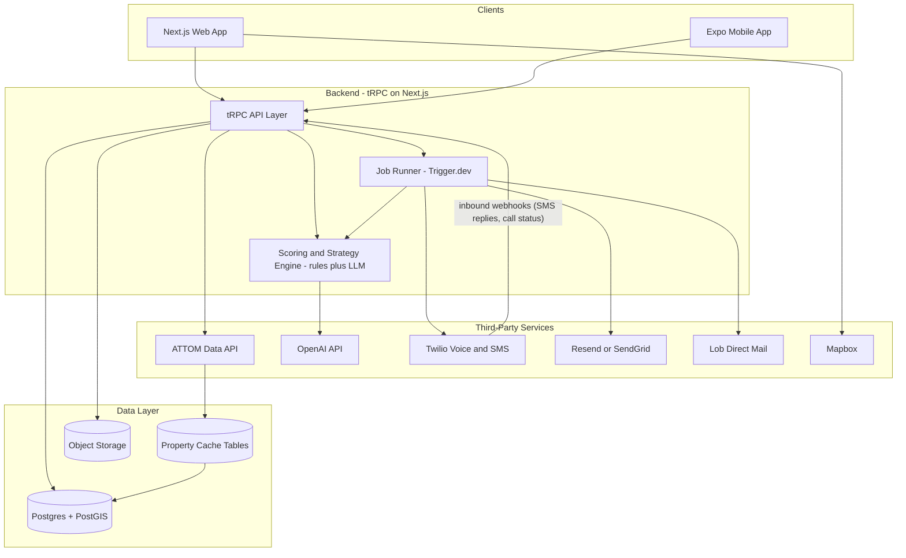
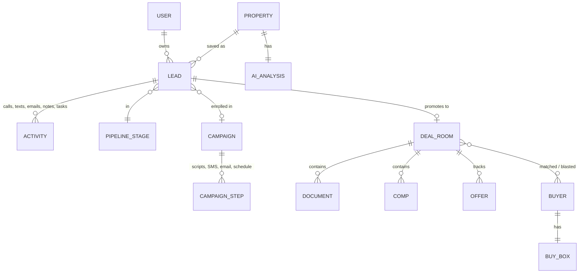

# Aurora DealFlow — Architecture & Milestone Plan

## Product in One Line

Property data (ATTOM) + AI deal strategy + CRM + automated follow-up + deal management, delivered as a web app and a companion mobile app sharing one TypeScript codebase.

## Tech Stack (chosen for one developer, maximum code sharing)

- **Monorepo**: pnpm + Turborepo
- **Web**: Next.js (App Router), Tailwind, shadcn/ui, Mapbox GL JS
- **Mobile**: Expo (React Native), react-native-maps or Mapbox SDK
- **API layer**: tRPC (end-to-end types, consumed by both web and Expo)
- **Database**: Postgres + PostGIS (Supabase or Neon) with Drizzle ORM
- **Auth**: Clerk (first-class Next.js + Expo support) or Supabase Auth
- **Background jobs / scheduling**: Trigger.dev or Inngest (follow-up sequences, campaign drips, score refreshes) — avoids managing Redis/BullMQ yourself
- **Property data**: ATTOM API (Property, AVM, Sales Comps, Pre-Foreclosure, Tax Assessor endpoints)
- **AI**: OpenAI API — deterministic rules engine computes the 1–100 score; LLM generates the narrative summary, strategy recommendation, and scripts
- **Comms**: Twilio (Voice + SMS, 10DLC registration), Resend or SendGrid (email), Lob (direct mail)
- **Files/photos**: S3-compatible storage (Supabase Storage or Cloudflare R2)

### Monorepo layout

```
aurora/
  apps/
    web/          # Next.js — full product
    mobile/       # Expo — field companion app
  packages/
    api/          # tRPC routers (all business logic)
    db/           # Drizzle schema + migrations
    core/         # scoring engine, strategy rules, shared types/utils
    integrations/ # attom, twilio, resend, lob, openai clients
```

## System Architecture




### Key architectural decisions

- **ATTOM as pass-through + cache, not a bulk import.** Searches hit ATTOM live (or cached results); only when a user **saves a lead** does the property get fully normalized into local tables (property, owner, valuation, mortgage, tax, sale history snapshots). This controls API costs and avoids data licensing problems.
- **Score is explainable, not an LLM guess.** A deterministic rules engine in `packages/core` computes the 1–100 score from weighted signals (equity %, ownership length, absentee flag, vacancy, pre-foreclosure, tax delinquency, etc.). The LLM only writes the human-readable summary and strategy recommendation from those computed signals. This makes scores consistent, cheap, and debuggable.
- **Everything automated runs through the job runner.** Follow-up sequences, campaign drips, deal blasts, and scheduled score refreshes are durable scheduled jobs — not cron hacks — so sequences survive restarts and can be paused per-lead (e.g., stop sequence when owner replies).
- **Mobile is a focused field companion, not a clone.** Mobile v1 = search nearby / driving-for-dollars, lead list, pipeline, property profile, click-to-call/text, notes + photo capture. Heavy workflows (campaign building, deal room docs, dispo blasts) stay web-only.

## Core Data Model (simplified)




Pipeline stages (New Lead → Contacted → Interested → Appointment Set → Offer Made → Under Contract → Dispo → Closed / Dead / Follow Up Later) are a seeded, user-customizable table — not an enum — so teams can rename/reorder.

## Milestones

### Milestone 1 — Foundation + Property Search & Profile (the "PropStream core")

- Monorepo scaffold, CI, auth, base schema/migrations
  - ATTOM integration package: search (address/city/zip/county/radius/polygon), property detail, AVM, comps, pre-foreclosure, tax data; response caching
- Web: search UI with map (Mapbox draw-area + pin clusters) and filter panel (property type, price, equity, ownership length, absentee, vacant, pre-foreclosure, tax delinquent, recently sold)
- Property Profile page: owner + mailing address, value, mortgage/equity estimate, tax, sale/listing history, comps, map, photos
- "Save as Lead" → snapshots property into local tables
- **Done when**: a user can sign up, search a market, filter to distressed properties, open a full profile, and save leads.

### Milestone 2 — AI Layer: Opportunity Score + Strategy

- Rules-based scoring engine (weighted signals → 1–100) in `packages/core`, unit-tested
- LLM narrative: AI summary on every profile ("high equity, out-of-state owner, 18 years owned…")
- Deal Strategy Recommendation (list / cash offer / wholesale / hold / flip / buyer match / follow up later) with reasoning
- Score shown in search results for sorting/filtering ("sort by opportunity")
- **Done when**: every property shows a consistent score, summary, and recommended strategy.

### Milestone 3 — CRM Pipeline + Mobile App v1

- Kanban pipeline with customizable stages, drag-and-drop, lead detail view
- Notes, tasks with due dates, activity timeline per lead
- Expo app: auth, property search + nearby/map view, lead list, pipeline view, property profile with score, add note/photo, click-to-call/text via native dialer (pre-Twilio)
- **Done when**: leads move through the full pipeline on web, and the mobile app is usable in the field.

### Milestone 4 — Communications + Follow-Up Automation

- Twilio: provision numbers, A2P 10DLC registration, outbound/inbound SMS, click-to-call with logging, call recording (where legal); inbound webhooks update the lead timeline
- Email via Resend/SendGrid; direct mail via Lob (postcards/letters)
- Unified conversation thread per lead; AI-generated call scripts and message drafts contextualized by the lead's data and strategy
- Follow-up sequences: scheduled multi-step tasks/messages via job runner; auto-pause on reply
- **Done when**: a user can contact an owner by call/text/email/mail from inside the app and automated follow-ups fire on schedule.

### Milestone 5 — Campaign Playbooks

- Campaign engine: a campaign = saved filter + script set + SMS/email templates + follow-up schedule + target pipeline stages
- Seed prebuilt playbooks: High Equity Seller, Absentee Owner, Tired Landlord, Pre-Foreclosure, Buyer Need, Cash Buyer (Expired Listing ships later — see Risks)
- Bulk lead import from a search into a campaign; enrollment, throttled sending, per-campaign analytics (sent / replies / leads advanced)
- **Done when**: a user can launch a prebuilt campaign against a filtered list and watch replies flow into the pipeline.

### Milestone 6 — Deal Room + Dispo Module

- Deal Room per serious lead: comps, repair estimate worksheet, offer calculator (MAO, ARV, assignment fee), documents, photos, closing checklist, tasks
- Dispo: cash buyer database with buy-box profiles (areas, price, property type, strategy), deal-to-buyer matching, deal blast (SMS/email) via campaign engine, offer tracking, assignment fee + closing status tracking
- Mobile v2: deal room summary + buyer match notifications
- Polish, billing (Stripe), production hardening, launch
- **Done when**: a lead can go save → score → contact → contract → blast to buyers → closed, end to end.

## Risks & Notes

- **ATTOM cost/licensing**: per-call pricing adds up; the cache-on-save design mitigates this, but confirm your ATTOM contract tier covers AVM + pre-foreclosure + comps endpoints before Milestone 1.
- **Expired Listings need MLS data** — ATTOM does not reliably provide listing status. That campaign requires an MLS feed (e.g., via a RESO Web API partner) and is deferred until access exists.
- **A2P 10DLC approval takes days–weeks** and real-estate cold outreach is heavily scrutinized; start Twilio brand/campaign registration at the beginning of Milestone 4, and include opt-out handling from day one.
- **Skip tracing** (owner phone numbers/emails) is not included in ATTOM property data; plan a provider like BatchData Skip Trace or Direct Skip as an add-on integration in Milestone 4.
- Each milestone is scoped to roughly 3–6 weeks of solo full-time work; total ~5–7 months to a launchable v1.

